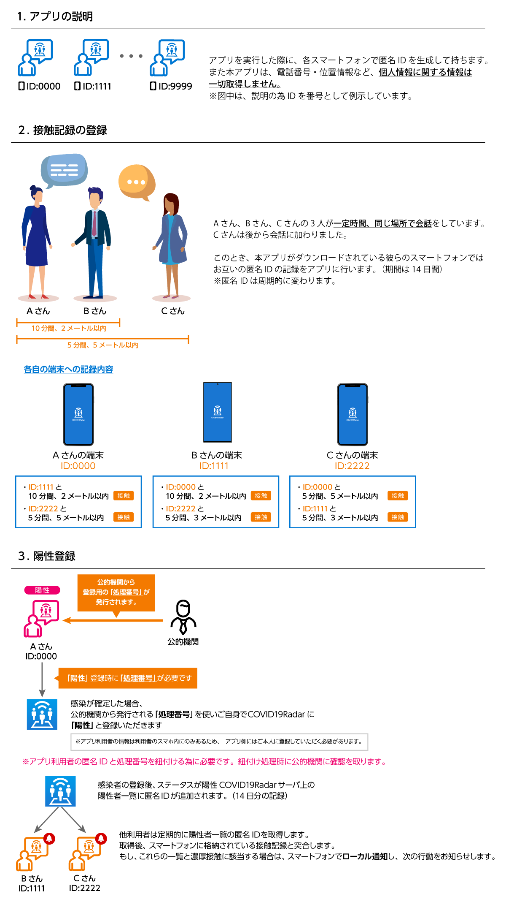
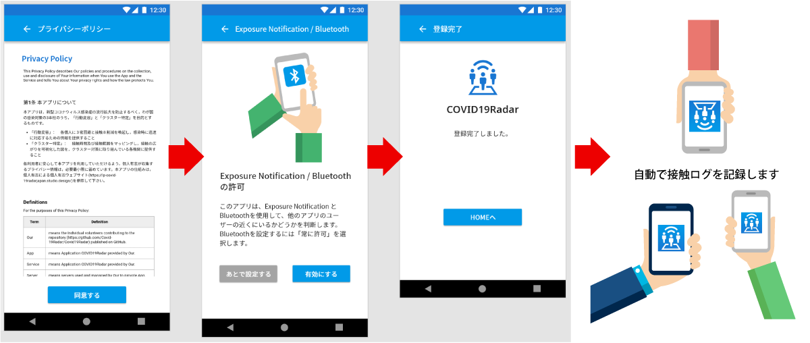

# Covid19Radar (Japanese)

Now, We move to GitHub Org [Project Covid19Radar](https://github.com/Covid-19Radar)

iOS Builstatus 
Android Build status 

本アプリは、Exposure Notification / Bluetooth(BLE/iBeacon)を利用して、お互いの接触ログを取得します。

## Thank you for Your Contribute !!! [Contributors List](https://github.com/Covid-19Radar/Covid19Radar/blob/master/CONTRIBUTORS.md)
コントリビューションとプルリクエストをお待ちしています。
コントリビューションルールについて、ご確認ください。
[Contribute Rule](https://github.com/Covid-19Radar/Covid19Radar/blob/master/HOW_TO_CONTRIBUTE.md)

## テスト用にアプリをインストールするには

以下のリンクからアプリをテスト用にインストールしてください:

### Android端末

https://install.appcenter.ms/orgs/Covid19Radar/apps/Covid19RadarAndroid/releases

テスト用のデバイスの構成は、以下のドキュメントを参照してください:
https://docs.microsoft.com/ja-jp/appcenter/distribution/testers/testing-android

### iOS端末

https://install.appcenter.ms/orgs/Covid19Radar/apps/Covid19RadarIOS/releases

テスト用のデバイスの構成は、以下のドキュメントを参照してください:
https://docs.microsoft.com/ja-jp/appcenter/distribution/testers/testing-ios

### 開発環境について

クライアント側は、Xamarin Forms(iOS and Android) with C# と Prism(MVVM IoC)を使っています。Visual Studio for Windows もしくは Visual Studio for Macで開発可能です。

https://visualstudio.microsoft.com/ja/xamarin/

デバイスの以下の機能の利用許可が必須となります。 

1. Exposure notification
2. Bluetooth

設定完了後、本アプリをインストールしている人同士の接触ログを自動で記録します。

# デザインについて

[Adobe XD](https://www.adobe.com/jp/products/xd.html)を利用してデザイン制作を行っています。

デザインファイルを確認する場合は、Adobe XDをインストールしてください。（無料で利用可能）

アプリケーションのより詳細な仕様とデータモデル、API仕様、関連業務知識に関しては、[濃厚接触検知のデータモデルと API仕様](doc/domain-model.md)をごらんください。

## アプリのプロトタイプ

以下のURLにアクセスすると、画面遷移を確認いただけます。

[プロトタイプ画面（日本語）](https://xd.adobe.com/view/9ccfd774-5667-4373-530f-591148c84aab-eafe/)

## ライセンス
Covid19Radar is licensed under the GNU Affero General Public License v3.0. See
[LICENSE](./LICENSE) for the full
license text.
