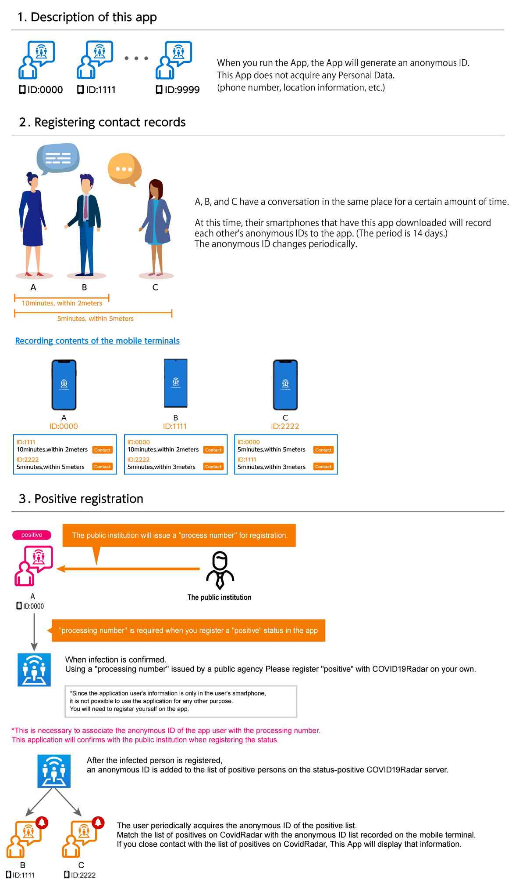

# Covid19Radar (English)/([Japanese](https://github.com/Covid-19Radar/Covid19Radar/blob/master/README.ja.md))

Now, We move to GitHub Org [Project Covid19Radar](https://github.com/Covid-19Radar)

We are looking for translator reviewers, Please see [How to Transrate application](https://github.com/Covid-19Radar/Covid19Radar/blob/master/HOW_TO_TRANSRATE_CONTRIBUTE.md) page.

iOS Build status 

Android Build status 

This app uses Exposure Notification / Bluetooth LE to get the contact logs of each other.  

## Thank you for Your Contribute !!! [Contributors List](https://github.com/Covid-19Radar/Covid19Radar/blob/master/CONTRIBUTORS.md)
We welcome contributions and pull requests.
Please check the contribution rules.
[Contribute Rule](https://github.com/Covid-19Radar/Covid19Radar/blob/master/HOW_TO_CONTRIBUTE.md)

## How to install the app for tester

Please install the app for test from below link.Currently, it is not possible to test until the SDK by Google / Apple is released to each beta version.

### Android

https://install.appcenter.ms/orgs/Covid19Radar/apps/Covid19RadarAndroid/releases

Device configuration guide for tester:  
https://docs.microsoft.com/ja-jp/appcenter/distribution/testers/testing-android

### iOS

https://install.appcenter.ms/orgs/Covid19Radar/apps/Covid19RadarIOS/releases

Device configuration guide for tester:  
https://docs.microsoft.com/ja-jp/appcenter/distribution/testers/testing-ios

## Development environment

This application uses Xamarin Forms (iOS and Android) with C # and Prism (MVVM DryIoC).
You can develop with Visual Studio for Windows or Visual Studio for Mac.

https://visualstudio.microsoft.com/ja/xamarin/

Permission to use the following functions of the device is required. 

1. Exposure notification
2. Bluetooth
3. Local Notification

After the setup is complete, the contact log between the people who have installed this app is automatically recorded.

# About the design

We use [Adobe XD](https://www.adobe.com/jp/products/xd.html) to create our designs.

If you want to check your design files, install Adobe XD. (available for free).

## App Prototypes

You can check the screen transition by accessing the following URL.

[Proto type mock（Sorry Japanese Only）](https://xd.adobe.com/view/9ccfd774-5667-4373-530f-591148c84aab-eafe/)

## Licensing

Covid19Radar is licensed under the GNU Affero General Public License v3.0. See
[LICENSE](./LICENSE) for the full license text.

The following are additional items in this license depending on the intention of the original author.
In Addition to AGPL, this project not permit exercise of moral rights of co-authors.
Dispute or litigation by each author is not allowed.

## About 3rd Party Software

This file incorporates components from the projects listed [document](./COPYRIGHT_THIRD_PARTY_SOFTWARE_NOTICES.md).
