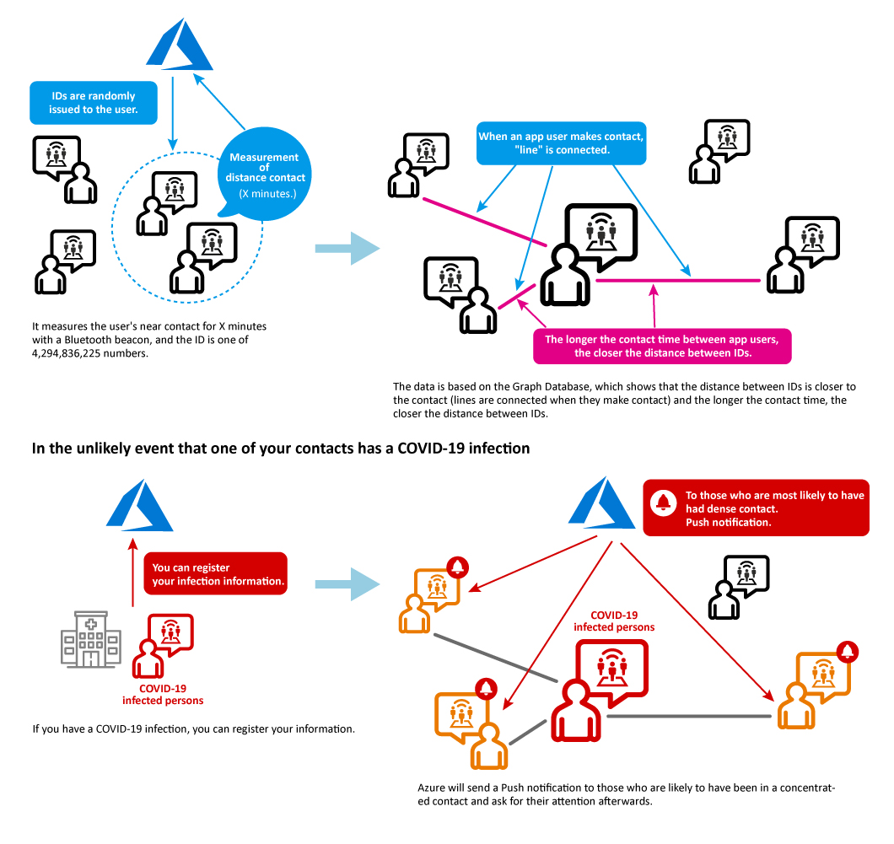
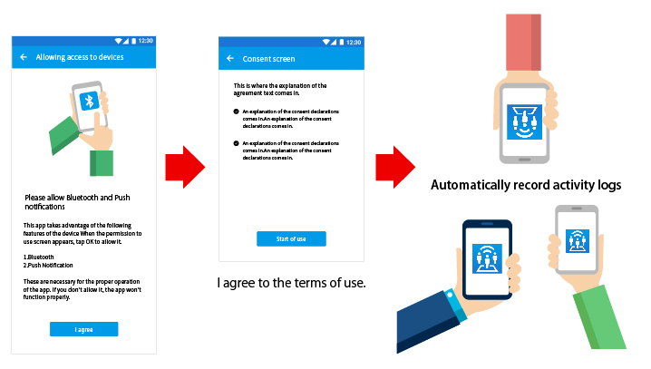
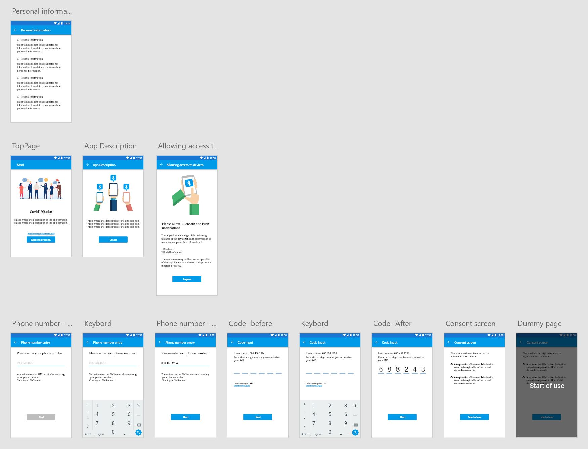
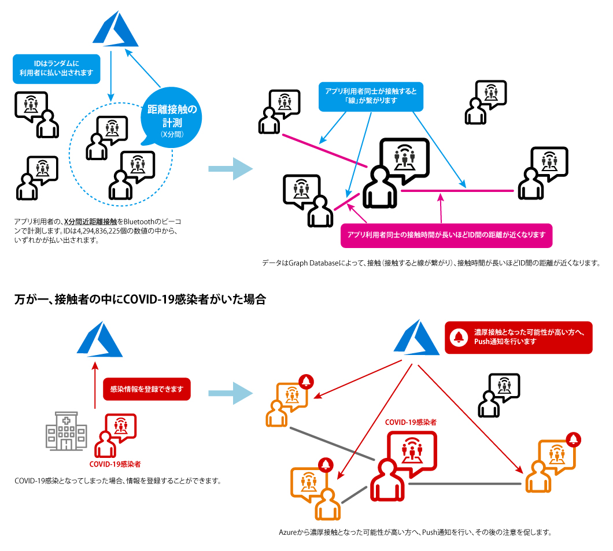
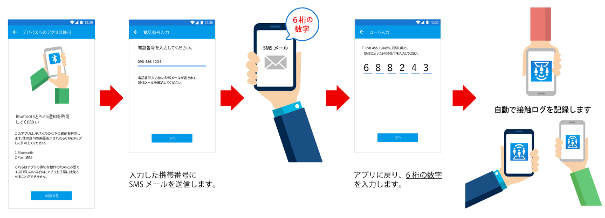
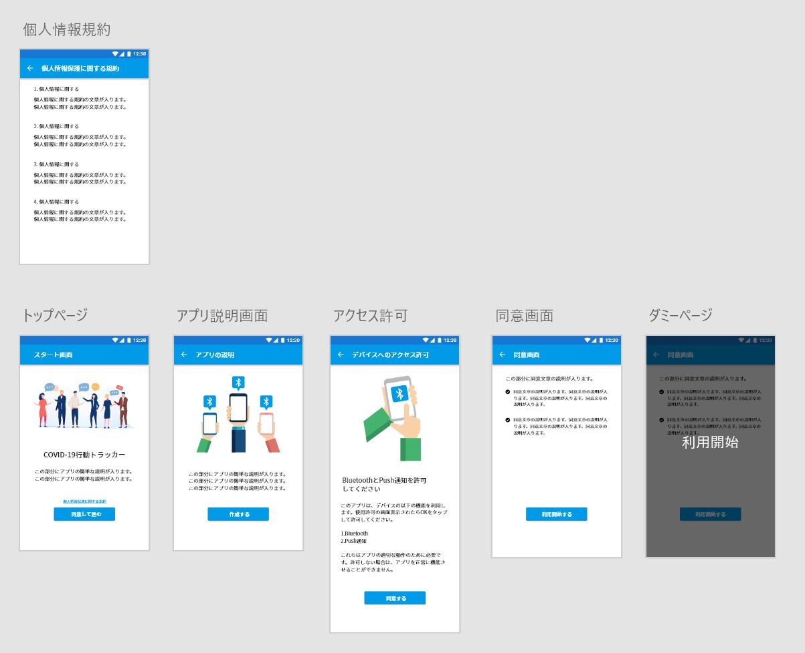

# Covid19Radar(English / Japanese ver is below 日本語版は下にあります。)

Discord Channel
https://discord.gg/e5hMm4h

Acknowledgments and Contributor
Noriko Matsumoto (Designer/Device iOS Lending)
Kazuki Ota (Create Build pipeline on AppCenter)
Taiki Yoshida (Power BI / Power Apps)
Yasuaki Matsuda (Server side / Azure Fucntions)
Tsuyoshi Ushio  (Server side / Azure Fucntions)
Takeshi Sakurai (Client iOS)
Fumiya Kume (Client Xamarin)
Takayuki Hirose (Device Mac Lending)

*This Application is UNDER DEVELOPEMNT!!*

This app uses Bluetooth to get the contact logs of each other.  
We are waiting for your contribution and pull request.

## How to install the app for tester

Please install the app for test from below link:(Sorry, currently available only Android)

https://install.appcenter.ms/orgs/Covid19Radar/apps/Covid19RadarAndroid/releases

Device configuration guide for tester:
https://docs.microsoft.com/ja-jp/appcenter/distribution/testers/testing-android

## Worked
- Screen transition and each screen design.
- Proximity communication between Android.

## Under develipment

- iOS iBeacon implementation , testing (I don't have a Mac)
- Add user (via REST API)
- Push Nortification
- SErver Side  API (Azure Function and CosmosDB)
- Arrangement of conditions of dense contact
- Graph DB(Cosmos DB) side Query , manage site（Server Side)

## Development environment

This application uses Xamarin Forms (iOS and Android) with C # and Prism (MVVM IoC).

You can develop with Visual Studio for Windows or Visual Studio for Mac.

https://visualstudio.microsoft.com/ja/xamarin/

Permission to use the following functions of the device is required. 

1. Bluetooth
2. Push Notification

After the setup is complete, the contact log between the people who have installed this app is automatically recorded.

# About the design

We use [Adobe XD](https://www.adobe.com/jp/products/xd.html) to create our designs.

If you want to check your design files, install Adobe XD. (available for free).

Refer [DataModels and API](doc/domain-model.md) for more details about the spec. (Japanese only)

## App Prototypes

You can check the screen transition by accessing the following URL.

[Prototypes(English)](https://xd.adobe.com/view/37f0cf1d-ed5d-4328-5700-9c3f7c075307-41c1/?fullscreen)
Password：Covid19Radar

## Acknowledgments and Contributor
- [Noriko Matsumoto](https://twitter.com/nori790822) (Designer)

## Licensing
Covid19Radar is licensed under the Apache License, Version 2.0. See
[LICENSE](./LICENSE) for the full
license text.

------

# Covid19Radar (Japanese , English ver is above)
*このアプリケーションは開発中*です。
本アプリは、Bluetooth(BLE/iBeacon)を利用して、お互いの接触ログを取得します。

現時点では、Android同士のビーコン取得と画面遷移のみができており、以下の機能の実装が行われていません。
コントリビューションとプルリクエストをお待ちしています。

## テスト用にアプリをインストールするには

以下のリンクからアプリをテスト用にインストールしてください:（現時点では Android のみ対応しています）

https://install.appcenter.ms/orgs/Covid19Radar/apps/Covid19RadarAndroid/releases

テスト用のデバイスの構成は、以下のドキュメントを参照してください:
https://docs.microsoft.com/ja-jp/appcenter/distribution/testers/testing-android

## 実装済
- 画面遷移とデザイン
- Android同士での近接通信の検知と取得
 
## 未実装
- iOS iBeacon実装と検証 (私がMac持ってない)
- ユーザ追加(via REST API)
- Push Nortification
- サーバサイド API (Azure Function and CosmosDB)
- 濃厚接触の条件などの整理
- Graph DB(Cosmos DB)の表示処理など（サーバサイド)

### 開発環境について

クライアント側は、Xamarin Forms(iOS and Android) with C# と Prism(MVVM IoC)を使っています。Visual Studio for Windows もしくは Visual Studio for Macで開発可能です。

https://visualstudio.microsoft.com/ja/xamarin/

デバイスの以下の機能の利用許可が必須となります。 

1. Bluetooth
2. Push通知

設定完了後、本アプリをインストールしている人同士の接触ログを自動で記録します。

# デザインについて

[Adobe XD](https://www.adobe.com/jp/products/xd.html)を利用してデザイン制作を行っています。

デザインファイルを確認する場合は、Adobe XDをインストールしてください。（無料で利用可能）

アプリケーションのより詳細な仕様とデータモデル、API仕様、関連業務知識に関しては、[濃厚接触検知のデータモデルと API仕様](doc/domain-model.md)をごらんください。

## アプリのプロトタイプ

以下のURLにアクセスすると、画面遷移を確認いただけます。

[プロトタイプ画面（日本語）](https://xd.adobe.com/view/f60f0c48-af7b-48cb-42c3-e74e64d07020-803e/?fullscreen)

Password：Covid19Radar

## 謝辞/コントリビューター
- [Noriko Matsumoto](https://twitter.com/nori790822) (Designer)

## ライセンス
Covid19Radar is licensed under the Apache License, Version 2.0. See
[LICENSE](./LICENSE) for the full
license text.
