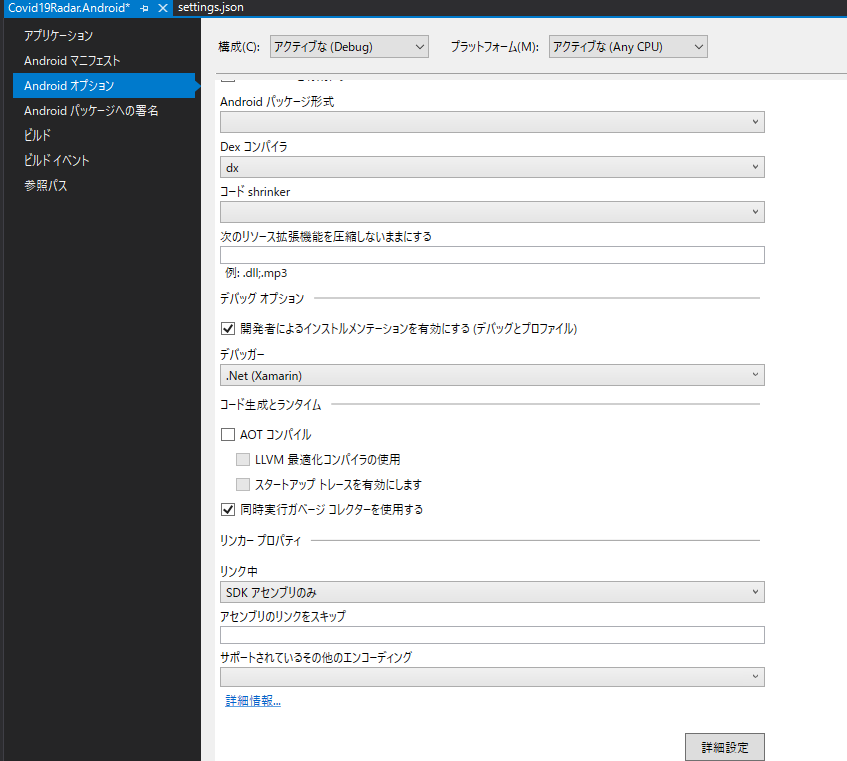
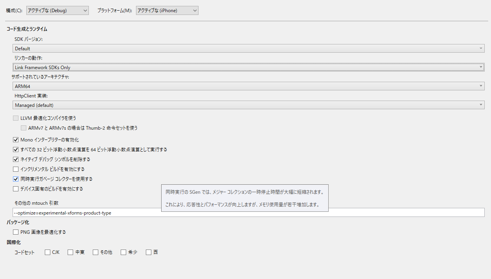
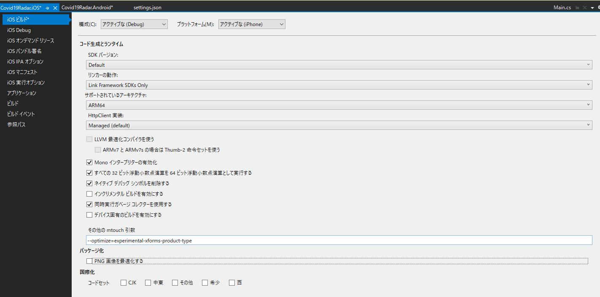

# Client Side Project Note

## Android
- Google Google SafetynetのAPIキーが必要です。 settings.json
- 現在、xamarin.exposurenotificationのNUGET版は、バックグラウンド動作でExceptionが出ます。直接プロジェクトを参照しています。
- Linker動作の変更が必要です。



## iOS

### Exposure Notification
- プロビジョニングプロファイルの適用は手動のみが対象です。
-　SDKバージョンは13.5以上（最新のXcodeを入れてください）
- Linker動作の変更が必要です。



### BGTask Issue

注：iOSで「BGTask」関連のAPIを使用するために必要なXamarin.iOS修正保留リリースが必要です。定期的なバックグラウンドフェッチタスクを呼び出すには、以下のパッケージの導入と修正が必要です。修正がまもなくリリースされる安定バージョンで利用可能になるまで、これらのビルドをインストールしてビルドしてください。リモートビルドを行う際には、Runtimeを更新しないでください。

> * [xamarin.ios-13.18.2.1.pkg](https://bosstoragemirror.blob.core.windows.net/wrench/jenkins/d16-6/29c4ea73109b377a71866c53a6d43033d5c5e90b/49/package/notarized/xamarin.ios-13.18.2.1.pkg)
> * [xamarin.mac-6.18.2.1.pkg](https://bosstoragemirror.blob.core.windows.net/wrench/jenkins/d16-6/29c4ea73109b377a71866c53a6d43033d5c5e90b/49/package/notarized/xamarin.mac-6.18.2.1.pkg)
>
> See [Issue #44](https://github.com/xamarin/xamarin.exposurenotification/issues/44#issuecomment-634381146) for more details.

### App StoreにおけるUIWebView 廃止とWKWebView への移行
2020/4月にAppleは非推奨にしたことで、以下対応によって移行中です。
https://docs.microsoft.com/ja-jp/xamarin/xamarin-forms/user-interface/webview?tabs=windows

Linkerの動作変更と以下のオプションの追加が必要です。

```
--optimize=experimental-xforms-product-type
```




