# If you want to use this in your country
Apple and Google place restrictions on the use of this API by public health authorities only.
Therefore, you should contact Google and Apple through public health authorities.
These are required for the device to work. You need to gain access to the API.
The Exposure notification API requires a special account registration in order to operate on the actual device.
For more information, please contact Google and Apple through public health authorities.

## Google
1. Please contact through a public health official.
2. You need to submit the app signature to Google.For more information, talk to your Google representative.
3. Create New Development Google's account (Join google's exposure notification developer groups, For more information, talk to your Google representative.)
4. Create SafetyNet Attestation API  https://developer.android.com/training/safetynet/attestation?hl=en

## Apple

1. Please contact through a public health official.If you have Apple through public health authorities Account (You must Account Holder Role !!). You can request entitlement https://developer.apple.com/contact/request/exposure-notification-entitlement
2. Create App ID  (You must Account Holder Role !!)
3. Set Exposure Notification Entitlement in *Provisioning Profile* (You must Account Holder Role !! and not app identifiers)
4. Create Development Cert (App Manager Role) / Profile etc... (From here, it is the same as the general development method.)
5. Create New Key (Generate Device Check Key - using Apple's Device Check) in Apple Developer Connection. https://developer.apple.com/documentation/devicecheck

# Prepare Development Environment

Requirements, prepare IDE, see below
https://github.com/Covid-19Radar/Covid19Radar/blob/master/doc/HOT_TO_CREATE_DEV_ENV.md

# Build 1st time in simurator / emurator

1. Clone from GitHub and Open Covid19Radar Folder
2. Open Covid19Radar.sln
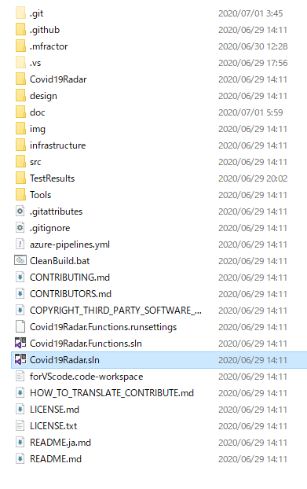

3. Check mockup mode in Visual Studio (see below)
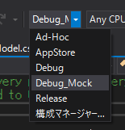

4. Right click Covid19Radar.iOS and Set as Startup Project (if you want run android)
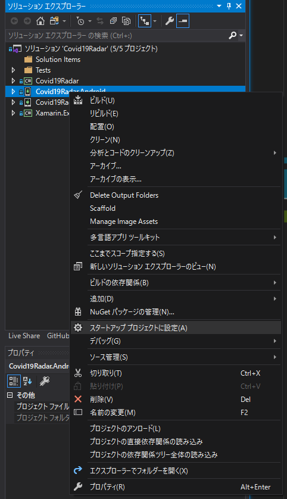

5. Ctrl + Build + B (Build Solution)


6. Debug in Emurator / Simulator (F5 Key)
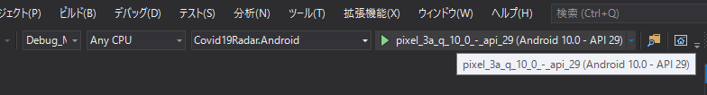

## Mockup / Test All Page mode

Originally it does not work without API, but there is a mockup mode to work with the emulator.
It is useful when you want to change the appearance or modify it.
Please note that in fact Exposure Notification is not working.

1. Check Covid19Radar\app.xaml.cs Xamarin.ExposureNotifications.ExposureNotification.OverrideNativeImplementation Comment out.

```
#if USE_MOCK
            // For debug mode, set the mock api provider to interact
            // with some fake data
            Xamarin.ExposureNotifications.ExposureNotification.OverrideNativeImplementation(new Services.TestNativeImplementation());
#endif
            Xamarin.ExposureNotifications.ExposureNotification.Init();
```

2. Check Covid19Radar\ViewModels\MenuPageViewModel.cs
OverrideNativeImplementation Comment out.
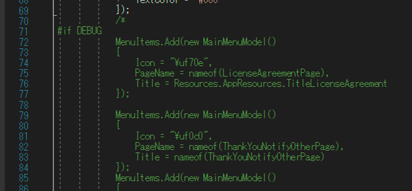

```
#if DEBUG
            MenuItems.Add(new MainMenuModel()
            {
                Icon = "\uf70e",
                PageName = nameof(LicenseAgreementPage),
                Title = Resources.AppResources.TitleLicenseAgreement
            });
...... MenuItems .....
            MenuItems.Add(new MainMenuModel()
            {
                Icon = "\uf0c0",
                PageName = nameof(SubmitConsentPage),
                Title = nameof(SubmitConsentPage)
            });
#endif
```

## Fix Transration in your country

This app uses Multilingul App Tool Kit to support internationalization.
The basic flow of modification is as follows.

### Check AppReousces.resx
The app references the key at Covid19radar\Resources\AppResources.resx.

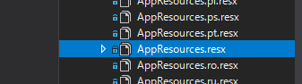
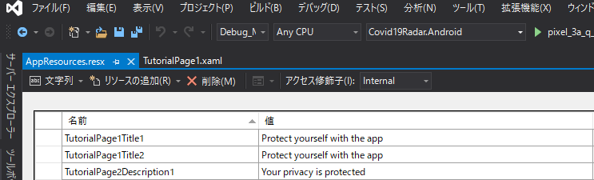
These resources have keys and values ​​defined in the default language, English.
Other national language resource files are automatically generated at build time.
From XAML under Covid19radar\view, it is called as follows.
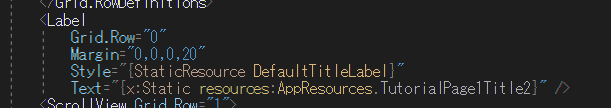
This case call resources:AppResources.TutorialPage1Title2 key.

```
<Label
    Grid.Row="0"
    Margin="0,0,0,20"
    Style="{StaticResource DefaultTitleLabel}"
    Text="{x:Static resources:AppResources.TutorialPage1Title2}" />
```

Call it from the program code as follows.This will be returned as the value type of string.
```
AppResources.TutorialPage1Title2;
```

### Modify XLF File
Each language exists in the xlf file (XLIFF2) format under Covid19radar\MultilingualResources.
Multilingual support is available by translating these keys.

AppResources.resx for each language is automatically generated when you build after editing with the XLIFF editor.

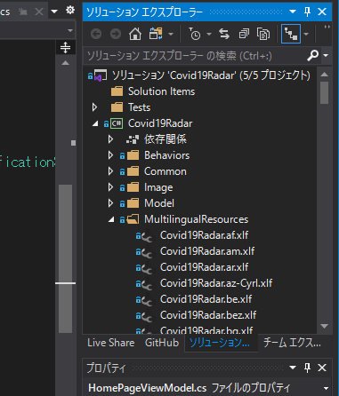

These can be edited with a common XLIFF2 editor, but are also distributed below.

https://developer.microsoft.com/en-us/windows/downloads/multilingual-app-toolkit/

## Change Image Resource

### iOS

The image resources for iOS are located at Covid19Radar\Covid19Radar.iOS.
The internationalized folder layout is based on general Apple rules.
Images are arranged here by country and resolution.

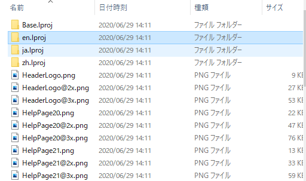

### Android

The image resources for iOS are located at Covid19Radar\Covid19Radar.Android.
The internationalized folder layout is based on general Google rules.
Images are arranged here by country and resolution.

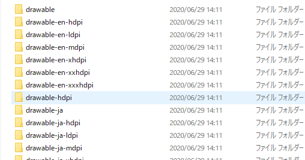

### Image Reference

These images can be displayed by entering the file name.
Please refer to the following XAML code.

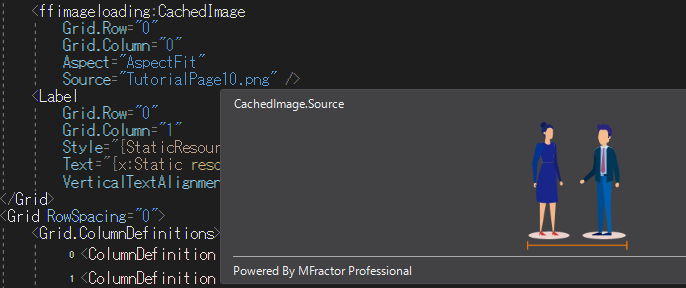

```
<ffimageloading:CachedImage
    Grid.Row="0"
    Grid.Column="0"
    Aspect="AspectFit"
    Source="TutorialPage10.png" />

```

### App-specific value
The required values ​​for this application can be found in Covid19Radar/settings.json.

```
{
  "appVersion": "APP_VERSION",
  "apiSecret": "API_SECRET",
  "apiUrlBase": "https://API_URL_BASE/api",
  "supportedRegions": "999",
  "blobStorageContainerName": "c19r",
  "androidSafetyNetApiKey": "ANDROID_SAFETYNETKEY",
  "cdnUrlBase": "https://CDN_URL_BASE/",
  "licenseUrl": "https://SOFTWARELICENSE_URL/",
  "appStoreUrl": "https://YOUR_APP_STORE_URL",
  "googlePlayUrl": "https://YOUR_GOOGLE_PLAY_URL",
  "supportEmail": "SUPPORT_EMAIL"
}
```

|  Name  |  Exsample Value  | Description  |
| ---- | ---- | ---- | ---- |
|  appVersion  |  Ver1.0  | Application version notation  |
|  apiSecret  |  Azure Functions API Host Key  | Azure Function API host API key  |
|  apiUrlBase  |  https://localhost:8081/api  | Server-side Azure Functions API endpoint URL,Please include up to /api.  |
|  supportedRegions  |  999  | MCC (Mobile Country Code). In the specification of Exposure Notification, use any value in each region. https://en.wikipedia.org/wiki/Mobile_country_code |
|  blobStorageContainerName  |  containername  | Azure Storage container name that stores files generated by batch processing of azure functions.  |
|  androidSafetyNetApiKey  |  ANDROID_SAFETYNETKEY_BASE64  | API key by google safetynet api.  |
|  cdnUrlBase  |  https://CDN_URL_BASE/  | An Azure Storage endpoint generated by an Azure Functions batch.CDN endpoint for CDN caching.  |
|  licenseUrl  |  https://CDN_URL_BASE/  | It is displayed as it is on the URL and WebView for the license notation.  |
|  appStoreUrl  |  https://CDN_URL_BASE/  | It is used when sharing the URL of the App Store and the download URL of the application.  |
|  googlePlayUrl  |  https://CDN_URL_BASE/  | It is used when sharing the URL of GooglePlay and the download URL of the application.  |
|  supportEmail  |  SUPPORT_EMAIL  | Often this app will need support center emails or some kind of support. This is your email address.  |


## Server Side Architecture / Automation CI,CD

see this doc
https://github.com/Covid-19Radar/Covid19Radar/blob/master/doc/HOW_TO_BUILD_SERVER_SIDE.md
https://github.com/Covid-19Radar/Covid19Radar/blob/master/doc/SERVER_SIDE_ARCHITECTURE.md
