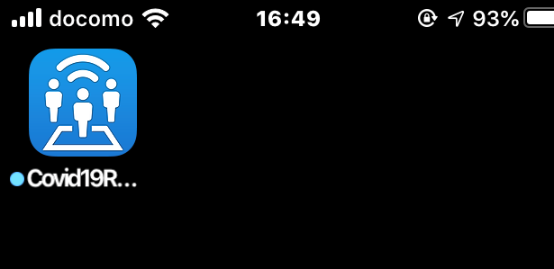
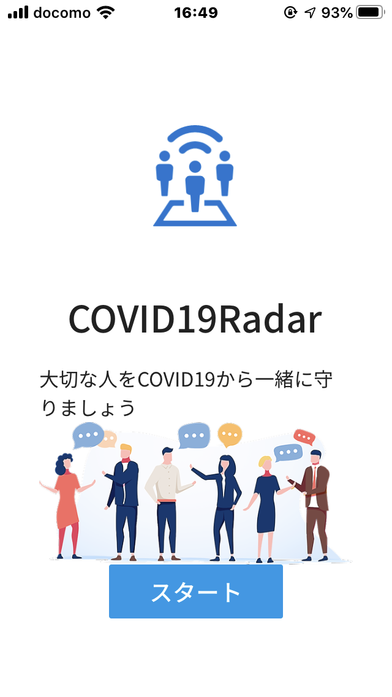
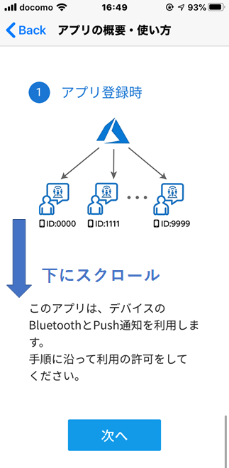
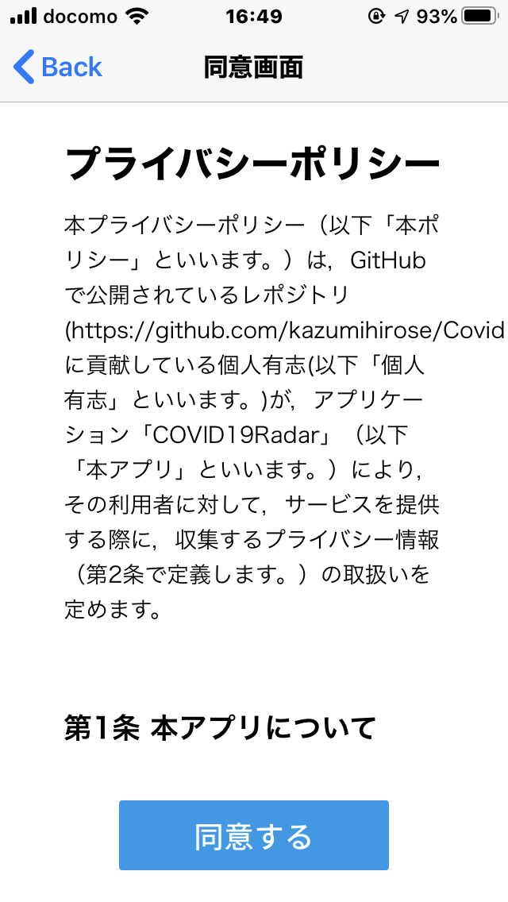
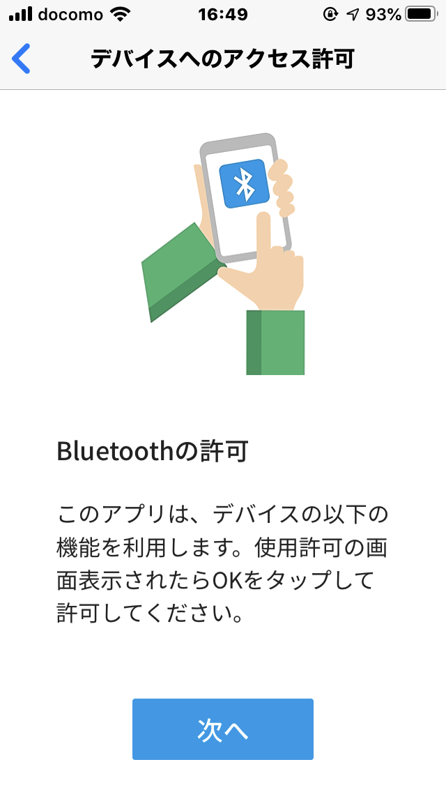
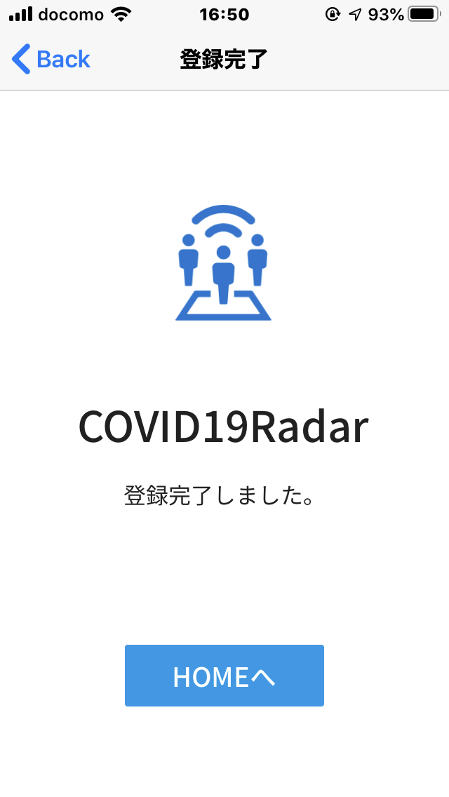
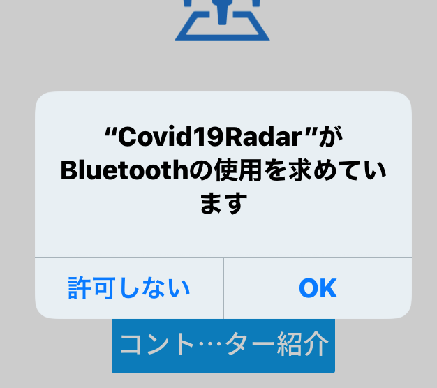
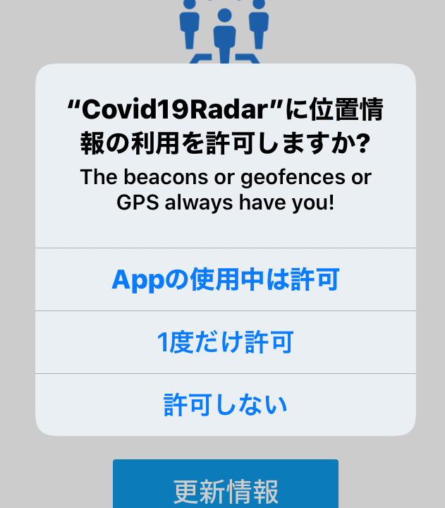

# COVID-19 Radar for iOS　使用方法

「COVID-19 Radar」アプリをご利用いただき、ありがとうございます。  
本ドキュメントでは、「COVID-19 Radar」iOS版の使用方法をご説明します。

### 注意事項
- 本ドキュメントは、Version 1.0 (184)をベースに作成されております。
- ご使用の機種・iOSバージョン等により、表示等が一部異なる場合があります。

## 1. アプリの起動
アプリのインストールが完了しましたら、ホーム画面にアイコンが表示されていますので、タップしアプリを起動します。  

アプリが初回起動しましたら、以下のように初回チュートリアルが開始されます。  
「スタート」をタップし、次に進みます。  

## 2. アプリの概要・使い方
「COVID-19 Radar」の概要についての解説です。  
下にスクロールしますと、最下部に「次へ」ボタンが表示されますので、タップして次に進みます。  

## 3. プライバシーポリシーへの同意
「COVID-19 Radar」のプライバシーポリシー（個人情報の取り扱いに関する規定）の同意画面です。  
同意いただけましたら、「同意する」ボタンをタップして次に進みます。  

## 4. Bluetoothの使用について
「COVID-19 Radar」は、iOSデバイスのBluetoothを使用します。  
「次へ」ボタンをタップして次に進みます。    

## 5. 登録完了
以上で、デバイスのサーバーへの登録が完了しました。
「HOMEへ」ボタンをタップして次に進みます。  

## 6. デバイスへのアクセス許可
アプリが接触情報を取得する為に、BluetoohおよびGPSへのアクセス許可をする必要があります。 
「OK」「Appの使用中は許可」をタップし、有効化します。  

以上で、サーバーへの初期チュートリアルは完了です。  

## 7. ホーム画面
以降、以下のホーム画面にて起動します。

## 陽性反応が出た場合
医療機関を受診し、PCR検査において陽性反応が確認された際には、以下の手順にて登録をお願いします。  
SMSにより電話番号を確認した後、アプリ内ではなく厚生労働省のデータベースに保管されます。  
併せて、「COVID-19 Radar」を使用しているユーザーのうち、接触した履歴のある方へ、匿名での通知がなされます。  

-----

「COVID-19 Radar」は現在開発中のアプリです。  
コミットする都度、最新版の通知がメールアドレスに来ますので、最新版を都度ダウンロードいただきますよう、よろしくお願いいたします。