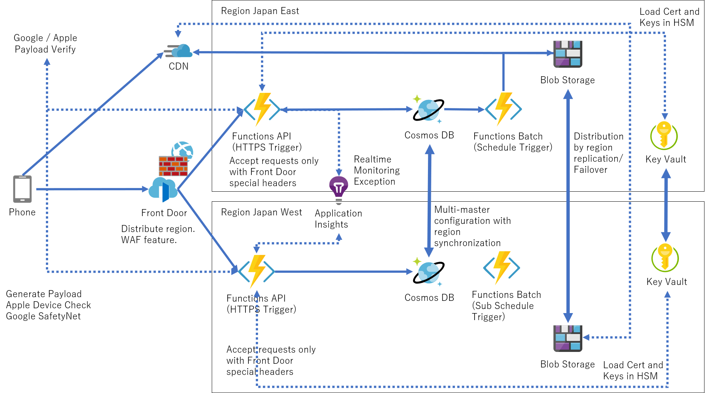
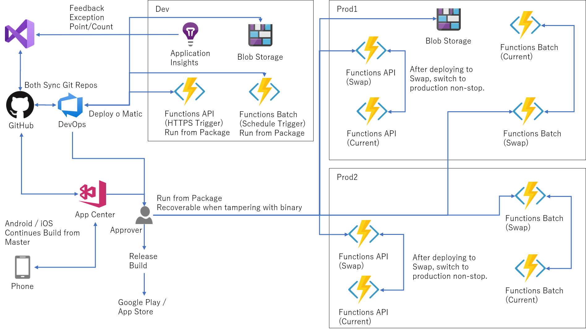

# Server side architecture

The server-side API has several mechanisms.
One is the Register API, which issues a UUID and Secret for API access of AES256 when the application starts to be used.
This is issued as an access key for accessing other APIs.
You can get Microsoft Azure from: All can be started for free and the design is designed to stay within the free usage range.

https://azure.microsoft.com/

## Development architecture
For development, it is designed so that you can pay a small amount.
Both are likely to fit within the free tier.

### Functions (REST API)
Azure Functions is used as a REST API.
In addition, the batch operation of schedule execution is also performed.
These are not fixed instances, but have a mechanism to automatically scale out according to traffic.

### Cosmos DB
The data store for this project.
During development, it is unlikely that the default 400RU will be used up.

### Functions (Batch Job)
Operates as a batch file process.
Generates positive diagnostic key in protocol buffer format.
These persist in storage blobs.
There is also a batch that deletes junk files that are more than two weeks old.

### Storage Blob
Blobs are regularly fetched from the client.

## Production architecture
The design example in production is shown below.

### FrontDoor
Azure Front Door has the functions of global distribution, traffic distribution, and web firewall.
Here, we limit DDOS attacks, OWASP and BOTNET, and limit the number of connections per second per IP.
In addition, there are restrictions such as allowing only IP access in the target countries.
Both are evenly distributed to provide automatic switching processing when a region failure occurs.

### Functions (REST API)
Azure Functions will only match the special request provided by Front Door and only accept the correct request.

### Application Insights
All instances are dynamically increasing and decreasing, so we are monitoring them with Application Insights.

### Cosmos DB
It syncs to two regions. The endpoint given at this time is an automatic failover endpoint.
Data written between two regions will be synchronized to both sides regardless of which one is written.

### Blob Storage
Blob storage operates in GRS replication mode.
The data written on one side (Japan East in this example) is synchronized with western Japan.
Failover can be performed if necessary.
Since it is actually cached in the CDN, you can only switch the destination of the CDN.

### CDN
It is responsible for caching the generated files in Blob storage.

### Key Vault (HSM)
This application handles a wide variety of keys.
For example, there are Google SafetyNet keys, Apple Device Check keys, and other keys for signing diagnostic keys and keys for verifying each signature.
These are all stored in the Key Vault and can be loaded only by the app that is allowed when the application starts.

## CI/CD Pipeline

Deployment to these is automated by the CI pipeline.

### Azure DevOps - GitHub

Once registered to Master on Github, it will also sync to Repos on DevOps.
The opposite is also true.
This is a remnant of Scrum development with the core team for a while.

### Azure DevOps
On the DevOps side, when an update occurs in the server side project under the src folder of the branch master, it is automatically placed in the Dev environment.

### App Center
App Center is responsible for the client build pipeline.
When the master is updated, the binaries for iOS and Android are automatically built and the startup test etc. are performed.

### Prod Pipeline

Once the release branch is updated, it will be pending confirmation by the approvers.
If this approval is passed, it will be deployed to the production environment.
In order to deploy without interruption, first deploy to the Swap slot, and then replace the running instances one by one.

In this pipeline build, the pre-built ZIP is deployed as Run from Package, and it is designed to be able to manually restore it in the event of a malfunction or tampering with the server.

Also, the Swap mechanism allows you to revert to the original state if there is a problem after the Swap.
