# Android版アプリのテスターの方へ

「COVID-19 Radar」アプリのテストにご参加いただきありがとうございます。  
本ドキュメントでは、テスターに向けてテストリリースのインストール方法をご紹介します。

## 前提条件
以下の手続きが完了している事を前提とします。
- [ベータテスターへの応募](https://bit.ly/2XSuVUJ) 
- ベータテスターへ応募した際のメールアドレスにて、  
Microsoftアカウント、もしくはGitHubアカウントの作成

## ドキュメント作成環境
本ドキュメントでは、以下の環境にてスクリーンショットの取得・動作確認を行っております。  
テスターの皆様の環境に応じて、適宜読み替えをお願いします。
- KYOCERA URBANO V02 KYV34
- Android 5.1

---
## アプリのインストール方法

### 1. 「提供元不明のアプリ」のインストールの許可
Androidデバイスにおいて、Google Playストア以外からのアプリ（提供元不明のアプリ）のインストールを許可します。  
「設定」アプリより、「セキュリティ」内に、「提供元不明のアプリ」の設定がありますので、「許可」に変更します。

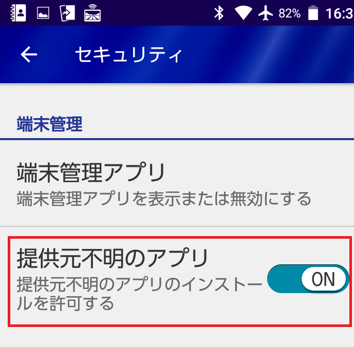

### 2. App Center にサインイン

[App Center](https://appcenter.ms/sign-in) に、Android端末 でアクセスします。  
QRコードスキャナアプリより、以下のQRコードをスキャンしてもアクセス可能です。  
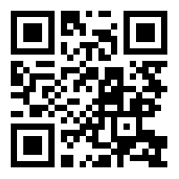

AppCenterのサインインページより、テスター登録時にFormに入力したメールアドレスでサインインをしてください。  

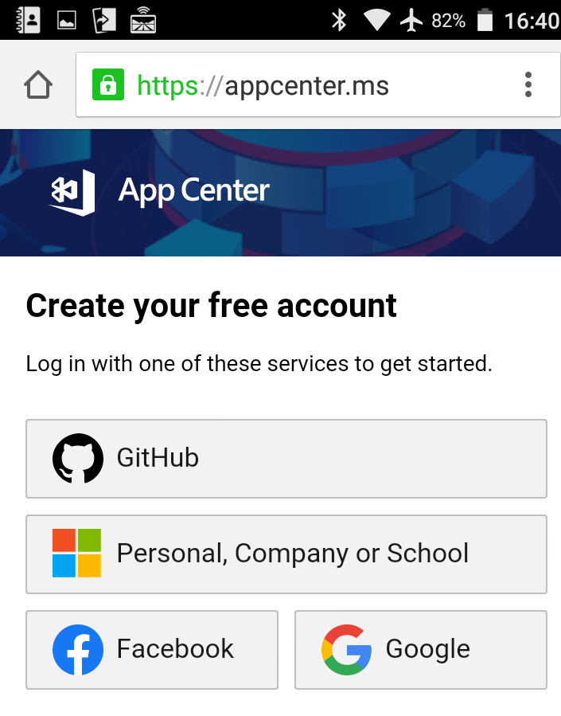

### 3. アプリのダウンロード

My Appsの画面にAndroid版とiOS版のアプリが表示されています。
「COVID-19 Radar」のAndroidアプリをクリックします。
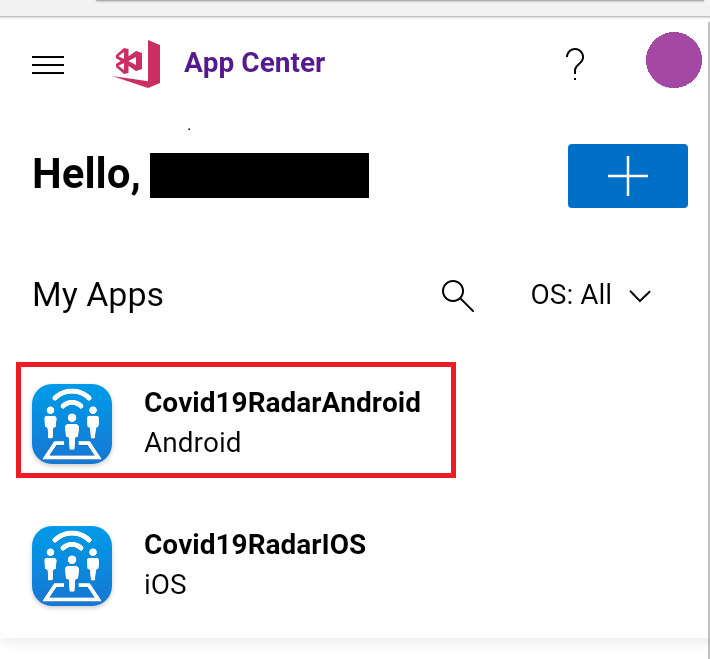

ダウンロードページへのQRコードが表示されますので、下部のリンク（赤枠部）をタップします。

現在リリースされているバージョンの一覧が表示されていますので、最上部の「Latest release」の「DOWNLOAD」ボタンをタップします。

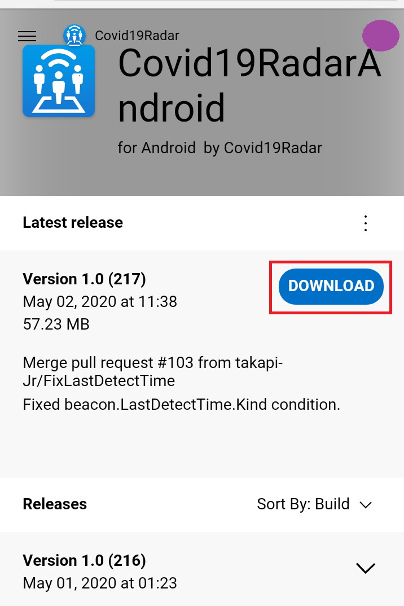

ブラウザ（Google Chrome)からのダウンロード許可を求めるポップアップが表示されます。

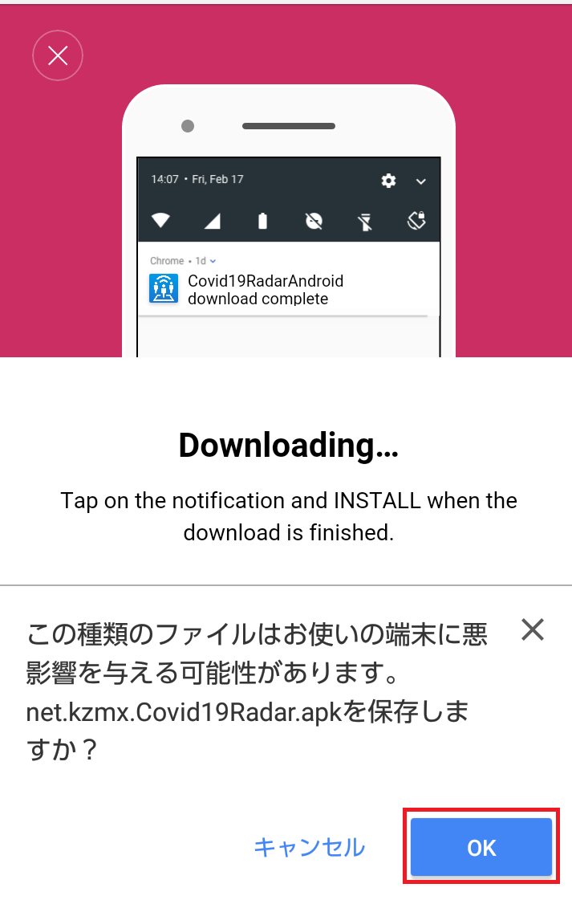

ポップアップの指示に従って「許可」してください。

### 4. アプリのインストール

APKファイルのダウンロードが完了しましたら、インストールを行います。  
ストレージにAPKファイルが保存されているので、パッケージインストーラにて開きます。
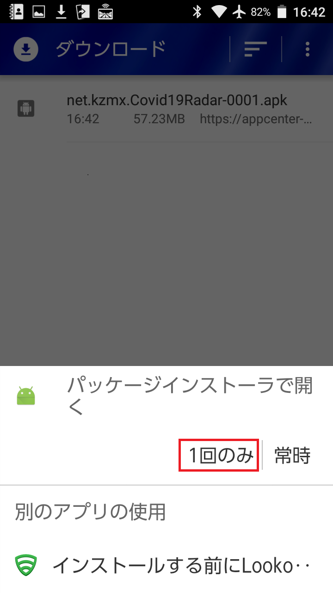

アプリケーションのインストールについて、確認がされますので、画面に従い「次へ」をタップします。
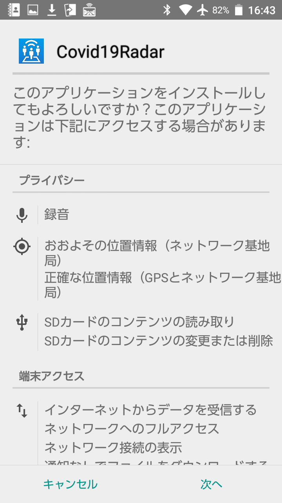

無事にインストールが完了すると、以下の表示になります。
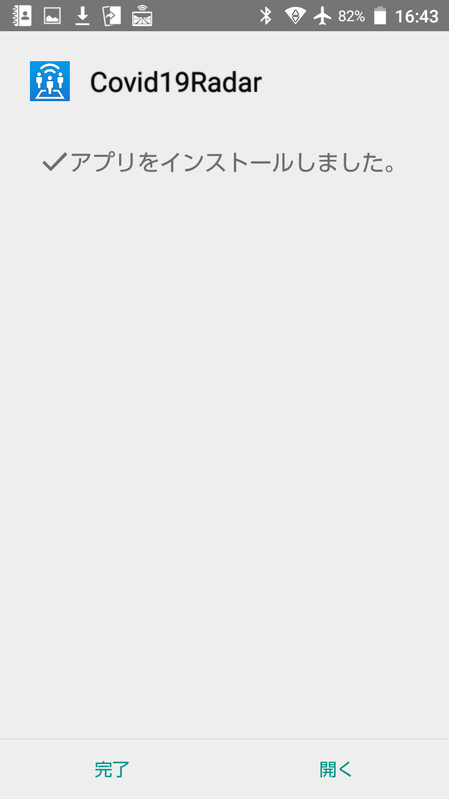

ランチャー内に「Covid19Radar」アプリが表示されていますので、こちらをご利用ください。
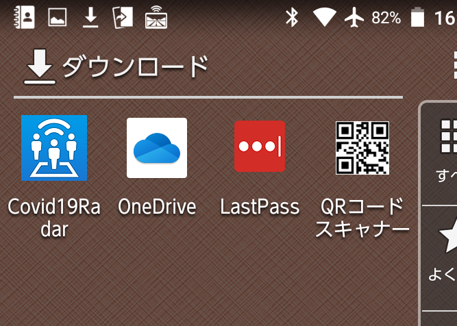

以上で、「Covid19Radar」のAndroidアプリをインストールすることができました。

---
## アプリのアップデート方法
アプリのテストビルドが終わる都度、最新版の通知が登録されたメールアドレスに届きますので、以下の手順で最新のアプリのダウンロード・インストールを行います。

### 1. メールの確認
テスト版のリリースについてはメールにて通知されておりますので、最新のアプリを手動でインストールします。
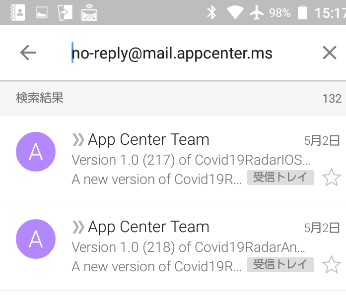

最新のリリースについて、以下のようなメールが届きますので、「Install」をタップしてAppCenterのダウンロードページを開きます。

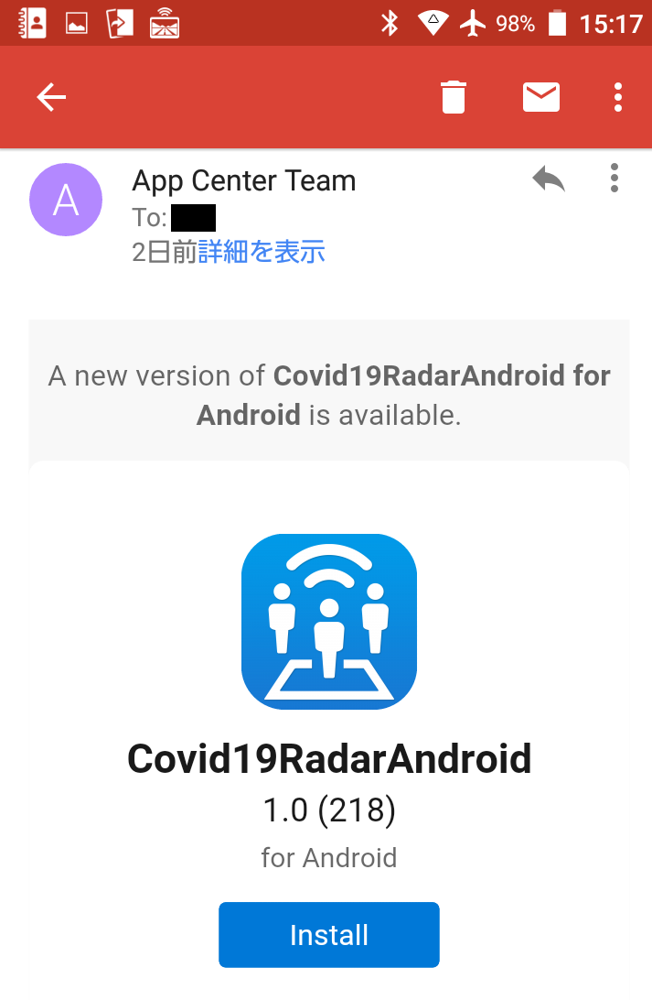

## 2. アプリのダウンロード
該当リリースのダウンロードページが開きますので、「DOWNLOAD」をタップして、アプリをダウンロードします。
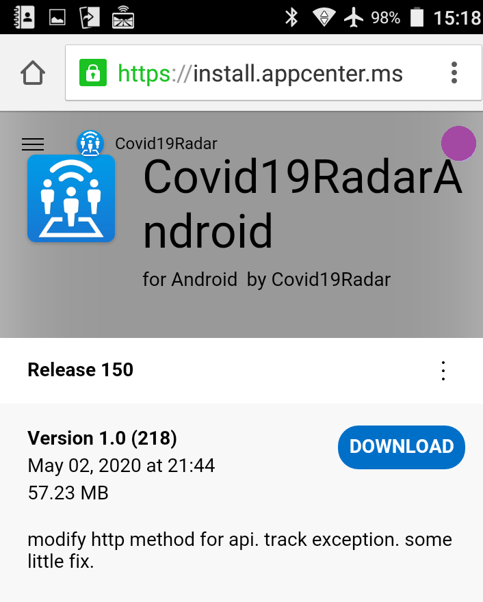

ダウンロードが始まりますと、以下のような画面になります。
以降、インストール時と同様にアプリのインストールをお願いいたします。
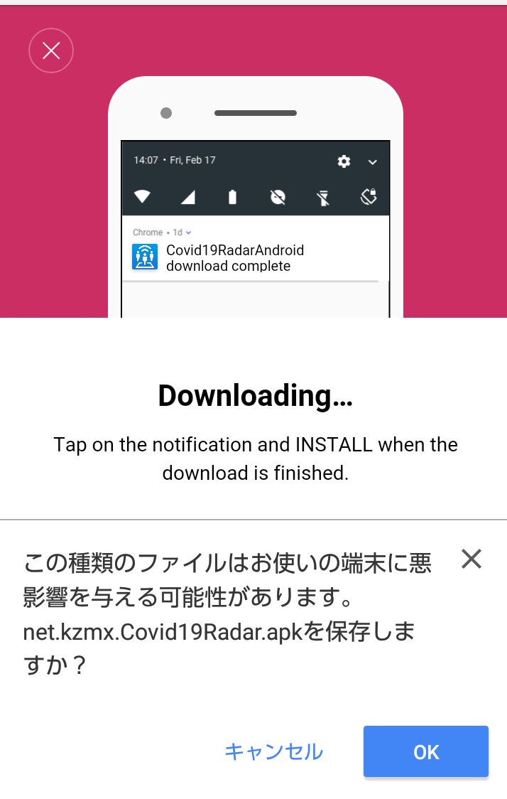

---
## アプリの利用方法
以下のドキュメントを参照してください。
[Covid19Radar(GitHub) - HOW_TO_USE for Android](https://github.com/Covid-19Radar/Covid19Radar/blob/master/doc/How-to-use/Android-how-to-use.ja.md)

---
## バグを発見した場合
バグの報告、および新機能の追加の提案をされたい場合、GitHub上リポジトリにて、Issueの作成をお願いします。  
詳細は、リポジトリ内の「HOW_TO_CONTRIBUTE」をご覧ください。  
[Covid19Radar(GitHub) - HOW_TO_CONTRIBUTE.md](https://github.com/Covid-19Radar/Covid19Radar/blob/master/HOW_TO_CONTRIBUTE.md)

## 相談をしたい場合
チャットアプリケーション(Discord)にて、コントリビューター同士のコミュニケーションを行っております。  
下記招待リンクより参加をお願いします。  
[Covid19Radar(Discord)](https://discord.gg/EzaYhD)
