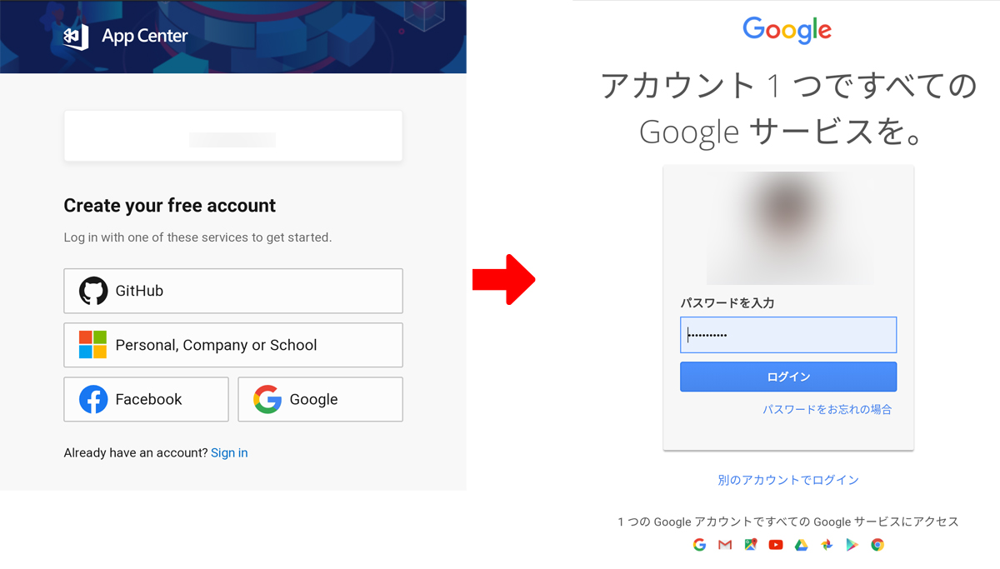
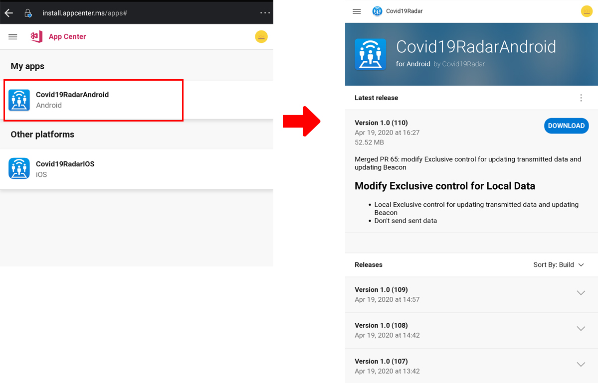
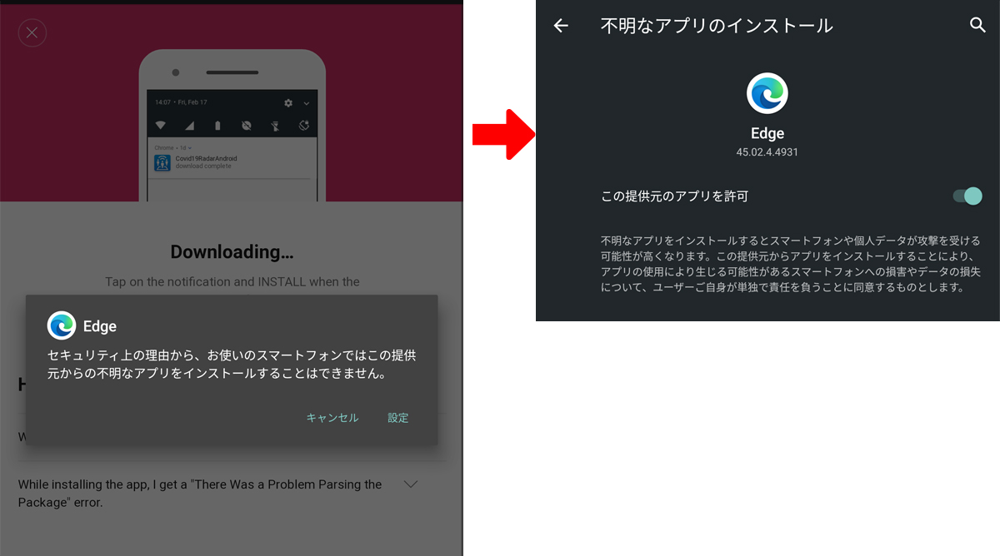
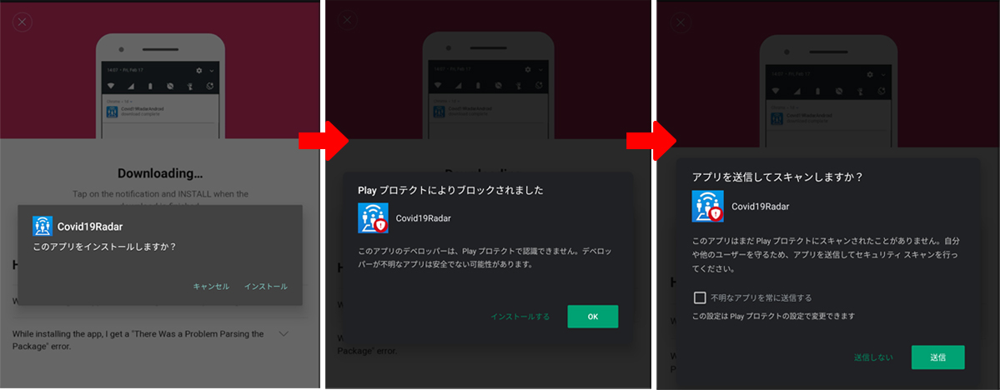

# Android版アプリのテスターの方へ

「COVID-19 Radar」アプリのテスターにご参加いただきありがとうございます。  
以下、手順を記載しますので参考にされてください。

## 1. App Center にサインイン

[App Center](http://apppcenter.ms/sign-in/) に、Android端末 でアクセスします。

テスター登録時にFormに入力したメールアドレスでサインインしてください。

## 2. アプリのダウンロード

My Appsの画面にAndroid版とiOS版のアプリが表示されています。

「COVID-19 Radar」のAndroidアプリをクリックし、次のページの「Latest release」の「DOWNLOAD」ボタンをクリック。

ブラウザ（Chrome/Edge)からのインストール許可を求めるポップアップが表示されます。

ポップアップの指示に従って「許可」してください。
以上の手順で、「Covid19Radar」のAndroidアプリをインストールすることができます。

-----

「COVID-19 Radar」は現在開発中のアプリです。  
コミットする都度、最新版の通知がメールアドレスに来ますので、最新版を都度ダウンロードいただきますよう、よろしくお願いいたします。