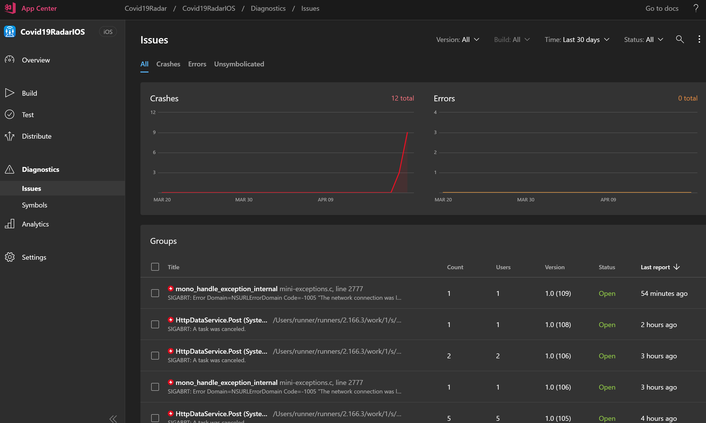
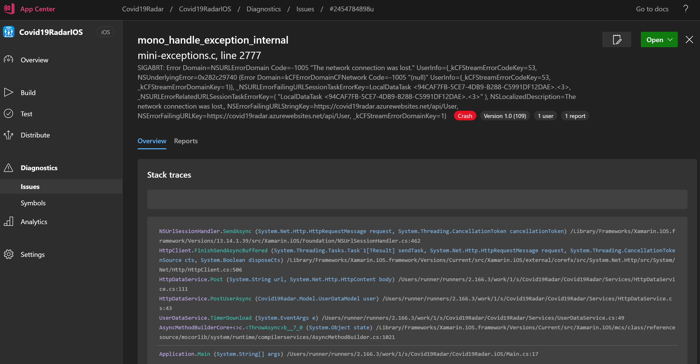
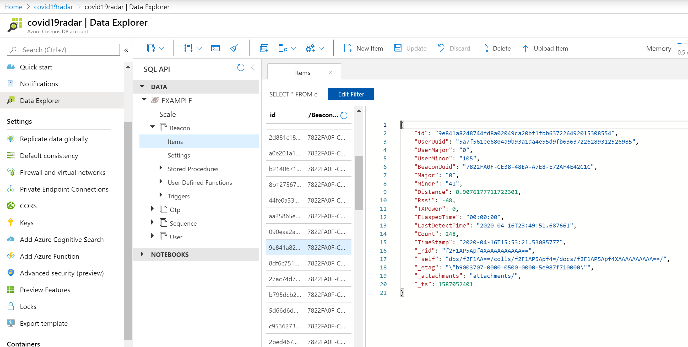
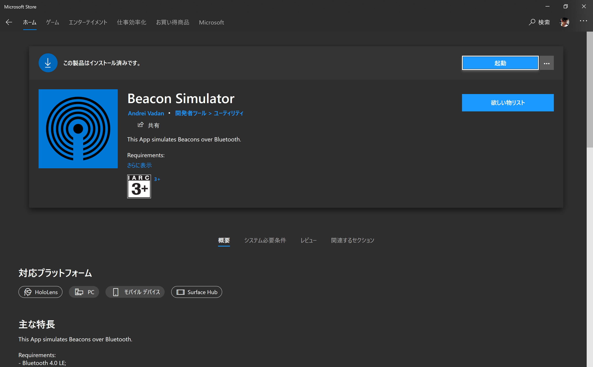
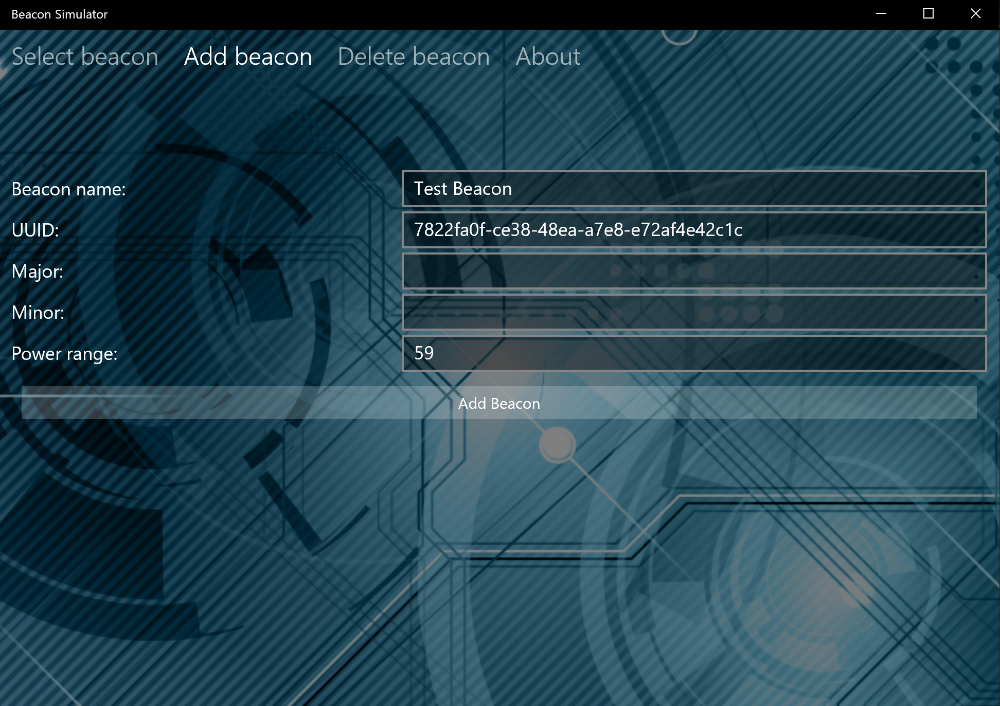
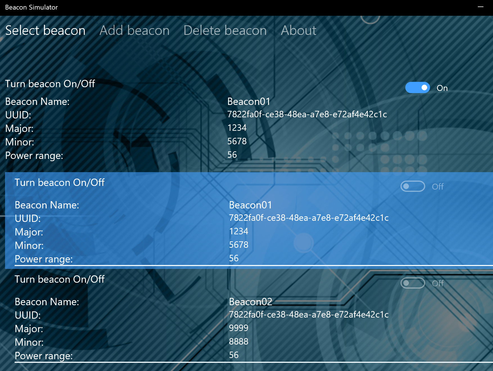

# テスターの皆様へ

この度は「COVID-19 Radar」アプリのテスターにご参加いただきありがとうございます。  
以下、手順を記載しますので参考にされてください。

## テストの開始
今回はAppCenterを用いて、テスターの皆様のアプリ不具合の記録を送信しております。これは、アプリクラッシュログと呼ばれており、私たちチームが皆さんのアプリで発生した不具合を確認する為に必要です。
具体的には、以下のようなログであり、テスターの皆様の個人情報やその他の情報は一切送信をしていません、ご理解いただけましたら幸いです。

## 起動テスト
アプリをダウンロードしましたら、アプリが正常に起動する事をご確認ください。

## ビーコン検出、送出動作について

アプリはユーザ登録が完了したのち、メニュー画面が表示されるようになります。こちらの画面が見えている間、もしくはバックグラウンド（他のアプリやHome画面に戻るなど）している間もiOSは一定時間、Adnroidは常に検出する為のビーコン送出とビーコン検出を行います。
また、収集されたビーコン情報は私たちの扱うサーバにアップロードされます。
どのようなデータがアップロードされているかは、以下をご確認ください。

## ビーコン検出テスト
ビーコンはiOSとAndroidなどOSやプラットフォームの違いを超えて通信できるように作られています。よって、以下のパターンが考えられます。

### iOS と もう一台のiOS

もし、iOSデバイスを二台お持ちの方がいましたら、二台とも登録いただき、アプリ起動後半径2m前後に設置してください。

### Android と もう一台のAndroid

もし、iOSデバイスを二台お持ちの方がいましたら、二台とも登録いただき、アプリ起動後半径2m前後に設置してください。

### iOS と もう一台のAndroid

もし、iOSデバイスとAndroidデバイスを双方二台お持ちの方がいましたら、二台とも登録いただき、アプリ起動後半径2m前後に設置してください。

### 1台のみの場合

Windows PCから疑似的にビーコンを出すエミュレーターソフトウェアを導入いただき、そのビーコンを着信する動作をテストいただきます。
PCはその場合Bluetooth 4.0 LE以後を扱える必要があります。なお、残念ながらMac OS Xのストアでは有償配布されている状態で、皆様にテストをお願いしづらい事情があります。
もし、無償でMac OS XからiBeacon送出が可能なソフトウェアなどをご存知の方は是非教えてください。

#### Windows 10 PC

Beacon Simuratorが無償で配布されていますので、こちらをWindows Storeから導入してください。

起動後、Add Beaconで以下の情報を登録してください。

UUID 7822fa0f-ce38-48ea-a7e8-e72af4e42c1c
Major 0から65535の番号のいずれか
(できれば100番以後のお好きな番号を指定)
Minor 0から65535の番号のいずれか
(できれば100番以後のお好きな番号を指定)
Power Range 59

Add Beaconで追加し、その後Select Beaconより追加したビーコンをOnにしてください。の後スマートフォンを周囲に設置してください。

